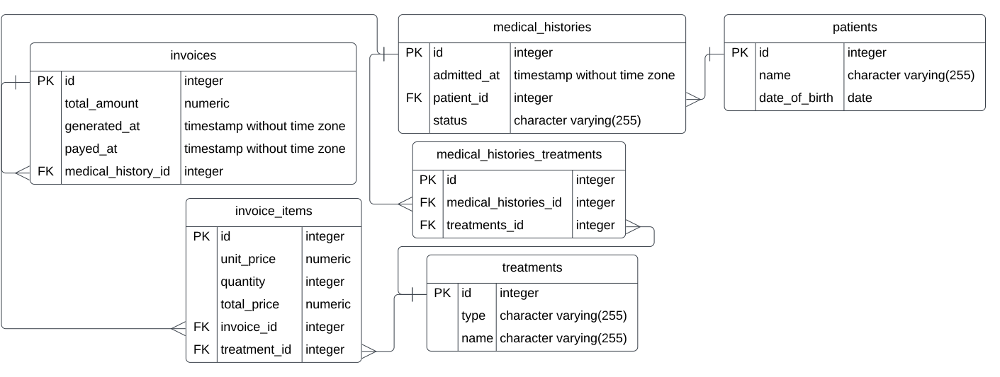

# 📗 Table of Contents

- [📗 Table of Contents](#-table-of-contents)
- [📖 Clinic Schema ](#-clinic-schema-)
    - [📊 Database Schema Diagram ](#-database-schema-diagram-)
  - [🛠 Built With ](#-built-with-)
    - [Tech Stack ](#tech-stack-)
    - [Key Features ](#key-features-)
  - [💻 Getting Started ](#-getting-started-)
    - [Prerequisites](#prerequisites)
    - [Setup](#setup)
    - [Install](#install)
    - [Usage](#usage)
    - [Run tests](#run-tests)
  - [👥 Authors ](#-authors-)
  - [🔭 Future Features ](#-future-features-)
  - [🤝 Contributing ](#-contributing-)
  - [⭐️ Show your support ](#️-show-your-support-)
  - [🙏 Acknowledgments ](#-acknowledgments-)
  - [❓ FAQ ](#-faq-)
  - [📝 License ](#-license-)

<!-- PROJECT DESCRIPTION -->

# 📖 Clinic Schema <a name="about-project"></a>

**Clinic Schema Diagram** This project uses a diagram of a data model clearly and explains what it's doing.

### 📊 Database Schema Diagram <a name="database-schema-diagram"></a>
<div align="center">
  
  <br/>
  
</div>

## 🛠 Built With <a name="built-with"></a>

### Tech Stack <a name="tech-stack"></a>

<details>
<summary>Database</summary>
  <ul>
    <li><a href="https://www.postgresql.org/">PostgreSQL</a></li>
  </ul>
</details>

### Key Features <a name="key-features"></a>

- **Data Tables**
- **Schema Diagram**

<p align="right">(<a href="#readme-top">back to top</a>)</p>

## 💻 Getting Started <a name="getting-started"></a>

To get a local copy up and running, follow these steps.

### Prerequisites

In order to run this project you need:


```sh
 sudo apt install postgresql postgresql-contrib
```

### Setup

Clone this repository to your desired folder:

``` sh
    git clone https://github.com/lucy-sees/Schema_Diagram
```

### Install

Install this project with:

``` sh
    sudo -i -u postgres
    git clone https://github.com/lucy-sees/Schema_Diagram
    cd Schema_Diagram
```

### Usage

To run the project, execute the following command:

```sh
  psql -f schema_based_on_diagram.sql 
```

### Run tests

To run tests, run the following commands:

```sh
  psql
  SELECT * FROM patients;
  SELECT * FROM medical_histories;
  SELECT * FROM treatments;
  SELECT * FROM invoices;
  SELECT * FROM invoice_items;
  SELECT * FROM treatments;
  SELECT * FROM medical_histories_treatments;

```

<p align="right">(<a href="#readme-top">back to top</a>)</p>


## 👥 Authors <a name="authors"></a>

👤 **Stanley Osagie Ramos**
- GitHub: [@sagieramos](https://github.com/sagieramos)
- Twitter: [@sagieramos](https://twitter.com/sagieramos)
- LinkedIn: [LinkedIn](https://linkedin.com/in/sagieramos)

👤 **Lucy W. Mwangi**
- GitHub: [@lucy-sees](https://github.com/lucy-sees)
- Twitter: [@lucy_w_mwangi](https://twitter.com/lucy_w_mwangi)
- LinkedIn: [LinkedIn](https://linkedin.com/in/lucy-wanjiru-mwangi)

<p align="right">(<a href="#readme-top">back to top</a>)</p>

## 🔭 Future Features <a name="future-features"></a>

- [ ] **[Make Queries]**
- [ ] **[Insert table data]**

<p align="right">(<a href="#readme-top">back to top</a>)</p>


## 🤝 Contributing <a name="contributing"></a>

Contributions, issues, and feature requests are welcome!

Feel free to check the [issues page](https://github.com/lucy-sees/Schema_Diagram/issues).

<p align="right">(<a href="#readme-top">back to top</a>)</p>


## ⭐️ Show your support <a name="support"></a>

If you like this project, please stay tune for more features

<p align="right">(<a href="#readme-top">back to top</a>)</p>

## 🙏 Acknowledgments <a name="acknowledgements"></a>

- I would like to thank all of my code reviewers for giving me constructive feedback and the [Microverse Team](https://www.microverse.org/).

<p align="right">(<a href="#readme-top">back to top</a>)</p>

<!-- FAQ (optional) -->

## ❓ FAQ <a name="faq"></a>

- **[How do I create a new PostgreSQL database?]**

  - [ou can create a new PostgreSQL database using the SQL command: CREATE DATABASE database_name;]

- **[What is the purpose of the \c command in PostgreSQL?]**

  - [The \c command is used to connect to a specific database in PostgreSQL, allowing you to work within that database.]

- **[What's the SQL command for inserting data into a table?]**
  - [You can insert data into a table using the SQL command: INSERT INTO table_name (column1, column2, ...) VALUES (value1, value2, ...);]

- **[How can I run SQL queries to retrieve data from a PostgreSQL database?]**
  - [You can run SQL queries in PostgreSQL using the psql command-line interface or through application code.]
  
- **[How can I view all tables in a PostgreSQL database?]**
  - [You can use the SQL command: \dt or \dt+ in psql to view all tables in the current database.]

<p align="right">(<a href="#readme-top">back to top</a>)</p>

<!-- LICENSE -->

## 📝 License <a name="license"></a>

This project is [MIT](https://github.com/lucy-sees/Schema_Diagram/blob/4a6ad2d1ede0ad52bbd7684797c2db261035a5cf/LICENSE) licensed.

<p align="right">(<a href="#readme-top">back to top</a>)</p>
